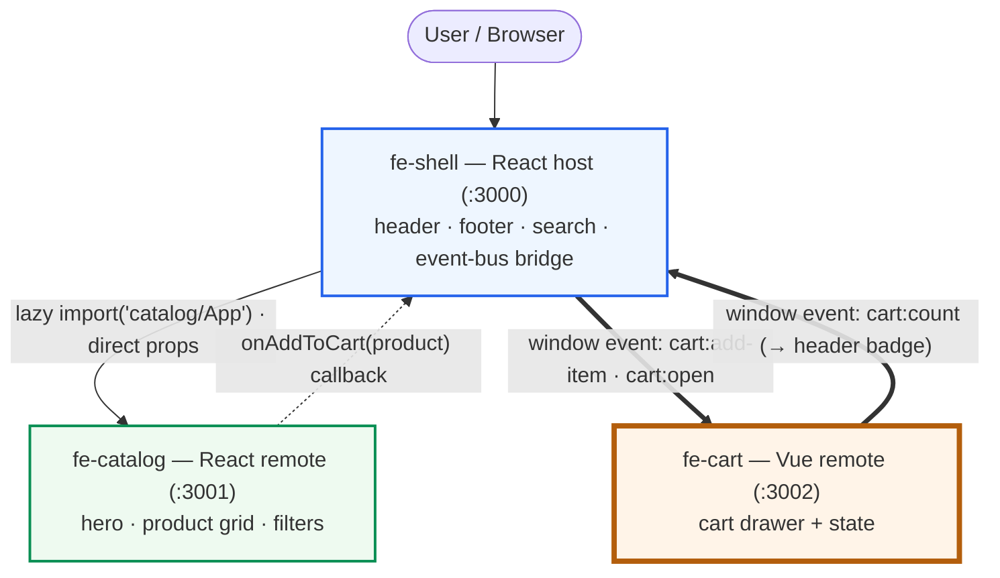
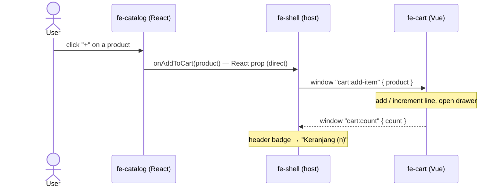

# fe-cart — Marqet cart remote (Vue 3)

The **cart** micro-frontend of the *Marqet* demo: the slide-in cart drawer and all
cart state. It's a **Module Federation remote** that exposes a framework-agnostic
`mount(el)` function and communicates with the rest of the app **only through a
`window` CustomEvent bus** — so a React host can embed a Vue island cleanly.

> Part of a 3-repo system: **[fe-shell](https://github.com/GDGoC-BiOn/fe-shell)** (host, React) · **[fe-catalog](https://github.com/GDGoC-BiOn/fe-catalog)** (catalog, React) · **fe-cart** (this).
> Live (standalone): https://gdgoc-bion.github.io/fe-cart/

---

## The system at a glance

| Repo | Stack | Port | Role | Exposes |
|------|-------|------|------|---------|
| fe-shell | React 18 | 3000 | Host — chrome + integrates remotes | — |
| fe-catalog | React 18 | 3001 | Remote — hero, product grid, filters | `./App` |
| **fe-cart** (this) | **Vue 3** | 3002 | Remote — cart drawer + state | **`./mount`** (mount/unmount) |

Three **separate, independently deployable repos**, wired at runtime via
`remoteEntry.js`. UI from [`@bion-mfe-ui`](https://gdgoc-bion.github.io/bion-mfe-ui)
(here, the **Vue** adapter `@bion-mfe-ui/vue`).

---

## Architecture

> **You are here: `fe-cart`** — a Vue remote the shell mounts into a `<div>`; it talks only via the event bus.



**Legend** — **solid** = host loads/consumes a remote (same-framework, direct props) · **dashed** = React callback back to the host · **thick** = cross-framework `window` event bus (this remote's only link to the rest of the app).

### Add-to-cart flow



---

## What this remote does

- Owns the **cart state** (a reactive map of line items) and renders
  `<CartDrawer>` from `@bion-mfe-ui/vue` (scrim, line items, quantity steppers,
  subtotal/total, checkout button).
- Exposes a **framework-agnostic** entry, **`./mount`** → `src/mount.ts`:

  ```ts
  export function mount(el: HTMLElement): void   // createApp(Cart).mount(el)
  export function unmount(): void
  ```

  The shell can't render a Vue tree as a React child, so it hands this remote a
  `<div>` and lets it own everything inside.
- Talks to the rest of the app **exclusively via the window event bus** (it never
  imports anything from the shell/catalog):

```
catalog "+" ─▶ shell ──"cart:add-item" {product}──▶  cart   (add line, open drawer)
header cart ─▶ shell ──"cart:open"────────────────▶  cart   (open drawer)
                                cart ──"cart:count" {count}─▶ shell  (update header badge)
```

### Event contract

| Event | Direction | Payload | Effect |
|-------|-----------|---------|--------|
| `cart:add-item` | in (shell → cart) | `{ detail: { product } }` | add/increment line, open drawer |
| `cart:open` | in (shell → cart) | — | open drawer |
| `cart:count` | out (cart → shell) | `{ detail: { count } }` | header badge updates |

The drawer's own close button, scrim, Esc key, and quantity steppers are handled
by the `@bion-mfe-ui` component; this remote only reacts to its `close` /
`quantity-change` / `checkout` events and re-renders state.

---

## Quick start

> Requires **Node ≥ 18** and **pnpm**.

```bash
pnpm install
pnpm dev          # http://localhost:3002
```

### Run it standalone

`src/standalone.ts` is a **solo dev harness** — `pnpm dev` mounts the drawer on
`:3002` with test buttons (**+ Headset**, **+ Smartwatch**, **Open cart**) that
fire the bus events, so you can develop the cart without the shell.

### Run inside the full app

```bash
# fe-catalog
pnpm dev          # :3001
# this repo
pnpm dev          # :3002  ← start before the shell
# fe-shell
pnpm dev          # :3000  ← open this
```

### Scripts

| Command | What it does |
|---------|--------------|
| `pnpm dev` | Vite dev server + standalone harness on `:3002` |
| `pnpm build` | Production build (emits `remoteEntry.js` + chunks) |
| `pnpm preview` | Serve the build on `:3002` |

---

## Configuration (`.env`)

| Variable | Meaning | Local default |
|----------|---------|---------------|
| `VITE_PUBLIC_URL` | Public origin this remote is served from (Vite `base`). Must serve `/remoteEntry.js` with CORS. | `http://localhost:3002` |
| `VITE_PORT` | Dev/preview server port | `3002` |

Copy `.env.example` → `.env` to override. Falls back to localhost without one.

---

## How it's built (vite.config.ts)

```ts
federation({
  name: "cart",
  filename: "remoteEntry.js",
  exposes: { "./mount": "./src/mount.ts" },
  shared: { vue: { singleton: true } },
})
// + vite-plugin-css-injected-by-js  (inline CSS into JS so the host can load
//   this remote's styles cross-origin)
// + build.target: "chrome89"
```

- Only **`vue`** is shared. **`lit` + `@bion-mfe-ui/*` are bundled, not shared**
  (perf: avoids a deep MF request waterfall; safe because
  `@bion-mfe-ui/core@^0.1.2` makes `customElements.define` idempotent). See the
  shell README for the rationale.
- Use the **adapter components** (`CartDrawer` from `@bion-mfe-ui/vue`), never raw
  `<bion-*>` tags in templates — otherwise Vue needs an `isCustomElement` compiler
  option.

---

## Component contract used here

`<CartDrawer :items :subtotal :total :open @close @quantity-change @checkout>`:

- `items` is a **property** (an array of `CartLine`), set reactively.
- `CartLine = { id, name, brand?, glyph?, qty, lineTotal }` — **`lineTotal` is a
  pre-formatted string**; the drawer does no currency math, this remote formats it.
- `subtotal` / `total` are formatted strings; `open` is reflected.

---

## Project structure

```
cart/
├─ index.html            # standalone dev page (#root)
├─ vite.config.ts        # federation remote config (exposes ./mount) — env-driven
├─ .env / .env.example
└─ src/
   ├─ mount.ts           # EXPOSED entry — createApp(Cart).mount(el) / unmount()
   ├─ Cart.vue           # cart state + <CartDrawer>; window event-bus wiring
   ├─ standalone.ts      # solo dev harness (test buttons that fire bus events)
   └─ types.ts           # MarqetProduct + glyphOf()
```

---

## Deployment (GitHub Pages)

`/.github/workflows/deploy.yml` deploys to Pages on push to `main`. **Enable
once:** *Settings → Pages → Source = GitHub Actions.* Built with:

```yaml
env:
  VITE_PUBLIC_URL: https://gdgoc-bion.github.io/fe-cart/
```

Deploy this **before the shell** the first time. Same-origin with the shell
(`gdgoc-bion.github.io`) → no CORS.

---

## Troubleshooting

| Symptom | Cause / fix |
|---------|-------------|
| Shell can't load the cart | This remote not running / wrong `VITE_CART_URL` in the shell / `remoteEntry.js` 404. |
| Adding a product does nothing | The cart only reacts to `window` `cart:add-item` events. In standalone, use the test buttons. |
| Drawer unstyled / transparent | tokens come from `@bion-mfe-ui/tokens/css` (imported in `mount.ts`); component styles need `@bion-mfe-ui/core@^0.1.2`+. |
| Two drawers / double close | Don't re-bind Esc/scrim — the `@bion-mfe-ui` drawer owns them; only handle its emitted events. |
